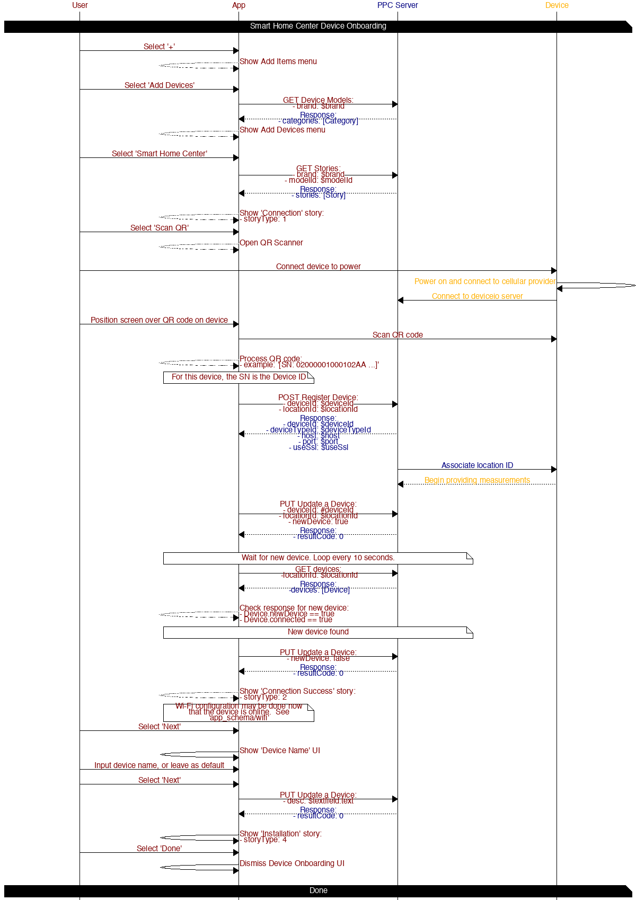
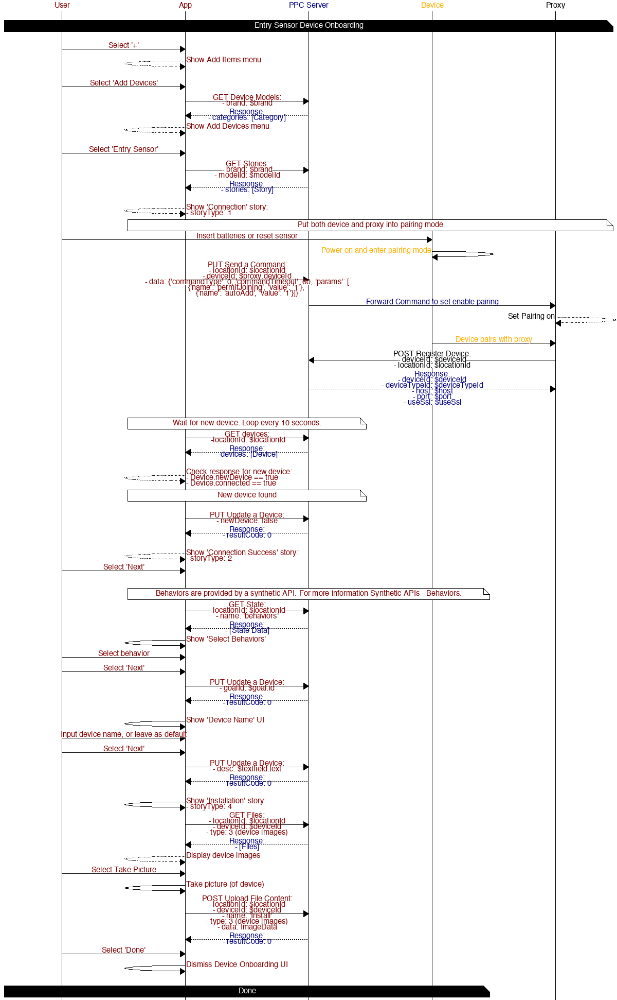

# Device Onboarding

## Table of contents

* [General Flow](#general-flow)
    * [Step 1 - Get available Device Categories and Models](#oobe-list-models)
    * [Step 2 - Select Device Model](#oobe-select-model)
    * [Step 2.1 - Define how to show device connection process](#oobe-check-requirements)
    * [Step 3 - Show OOBE Connection story](#oobe-connect)
    * [Step 3.1 - Connect device](#oobe-device-pairing)
    * [Step 3.2 - Wait for device pairing](#oobe-device-connection)
    * [Step 3.3 - Show OOBE Reconnect story](#oobe-device-reconnection)
    * [Step 4 - Show OOBE Success story](#oobe-success)
    * [Step 5 - Get into standard device setup](#oobe-device-configuration)
    * [Step 6 - Show OOBE Installation story](#oobe-install)
    * [Step 7 - Show device UI](#oobe-device-ui)
* [Page Styles](#page-styles)
    * [Info](#page-style-info)
    * [Connect](#page-style-connect)
    * [Picture](#page-style-picture)
* [Diagrams](#diagrams)
    * [Smart Home Center](#smart-home-center)
    * [Entry Sensor](#entry-sensor)
    * [Vayyar Home](#vayyar-home)
    * [D-Link Camera](#d-link-camera)

## General Flow

This is the general flow for onboarding devices.

### Step 1 - Get available Device Categories and Models

Call [GET Device Models](https://iotapps.docs.apiary.io/#reference/creating-products/device-models/get-device-models) API with parameters:

Params:
- `brand` - optional, by default will return "default" brand.
- `lang` - optional, by default will return user's language or default Server-configured language.

Depends of JSON data you've got from this call, draw the list of device types and categories. Here is mapping you may want to understand:

- `category` without parentId - Parent Category
- `category` with parentId - Child Category
- `models` - Device Models
    - `id` - Model ID
    - `pairingType` - Pairing Type
    - `dependencyDeviceTypes` - Dependency Device Types

### Step 2 - Select Device Model

The App may limit specific pairing types or configurations.  The model may define dependent devices that must be at the same Location.

`pairingType` - Pairing Type. Defines the mechanism to add device (e.g. QR Reader, Zigbee, etc.)
`dependencyDeviceTypes` - optional, array of device types.  At least one is required to pair this device.

If the dependency is not met, then notify the User.

### Step 2.1 - Define how to show device connection process

Call [GET Stories](https://iotapps.docs.apiary.io/#reference/creating-products/stories/get-stories) API with parameters:

Params:
- `modelId` - mandatory, use model.id from Device Models API data to get story only for that model
- `storyType` - optional, use to get specific type of story. See available [Story Types](https://iotapps.docs.apiary.io/reference/creating-products/stories).  
- `brand` - optional, by default will return "default" branded stories.
- `lang` - optional, by default will return user's language or default Server-configured language.

You'll need to show device connection process, so need to get OOBE connection story first (storyType ID is 1). If the story is not provided then notify user.

### Step 3 - Show OOBE Connection story

Each story provides details a set of pages. The App should show each page in order.  Some pages may include 1 or more action to help facilitate the connection process.

#### Step 3.1 - Connect device

Show device connection single page or other type of connection process (C2C connected devices) depends of `model.pairingType` only.

##### Pairing Types

Device Models may require 1 or more pairing type.

For example

* 1 - QR Scan - Uses a device camera, or show if device can't use camera show UI with input to type device ID manually (see [Smart Home Center](#smart-home-center)).
* 2 - Native - Uses native implementation.  It is the Apps responsibility to include association with specific model IDs.
* 4 - OAuth 2.0 - Used together with model.oauthAppId to open specific URL for every appId and authorize there, then use Server-side callback to show Web-view to confirm OAuth connection with third-party application.
* 8 - Zigbee - Used together with dependencyDevicetypes to support proxy/slave device onboarding
* 16 - Wi-Fi - Used to connect Wi-Fi enabled devices that communicate directly to our Cloud

#### Step 3.2 - Wait for device pairing

During the actual pairing process you'll need to wait for new device by calling [GET devices](https://iotapps.docs.apiary.io/#reference/devices/manage-devices/get-a-list-of-devices) API. Newly registered devices will include the property `device.newDevice=true` and may be used in coordination with `device.modelId` to understand if the desired device has been added.

Two options of result:

- Timeout - No new devices were found. If the page provides an action to link to a support page the user may do so.
- New Device Found - If a Connection Success story exists (`storyType == 2`) proceed to [Step 7]()

#### Step 3.3 - Show OOBE Reconnect story

Only show this step if story.storyType = 5 exist for selected model.id.
Show if user clicked on "That didn't work" link. See examples in PDFs. From Reconnect story you can go back to start over the OOBE Connection story (story.storyType = 2) if it exist.

### Step 4 - Show OOBE Success story

Only show this step if story.storyType = 3 exist for selected model.id. Typically, this is single page with "Next" button. See API mapping in PDFs.

### Step 5 - Get into standard device setup

This is standard for every device and pre-builded into application process. These should be presented in the following order.

1. Behaviors UI - If connected device type has [Behaviors](synthetic_apis/behaviors.md) then show the list of available behaviors. To get behaviors call to [GET State](https://iotapps.docs.apiary.io/#reference/synthetic-apis/states/get-state) API with the name `behaviors`. To select a Behavior call [PUT Update a Device](https://iotapps.docs.apiary.io/#reference/devices/manage-single-device/update-a-device) API with the selected `goalId`.  Alternatively, the [GET Goals by Device Type](https://iotapps.docs.apiary.io/#reference/creating-products/device-goals/get-device-goals-by-type) API may be used to retrieve behaviors if no Bot is present at this location.
2. Spaces UI - Spaces may be supported by a device.  If the device's `model.displayInfo` property provides a key `locationSpaces` with an array of space definitions `{'type': Int, 'name': String}` then show space selection. The selected Behavior may also describe preferred or suggested spaces.
3. Device Name UI - Choose name for your new device or keep default. Call to [PUT Update a Device](https://iotapps.docs.apiary.io/#reference/devices/manage-single-device/update-a-device) API to update `device.desc` (name).

When finished with all configuration screens go to the next step.

### Step 6 - Show OOBE Installation story

Only show this step if story.storyType = 4 exist for selected model.id. Multiple pages that explain details of device usage and in-house installation.

Often this is an opportune time to take a picture of this installation.  See [Page Styles](#page-styles) for more details

### Step 7 - Show device UI

After all, redirect user to device UI.

## Page Styles

### Info

Standard page style with media, subtitle, content, and actions.

*Identifier*

`info`

### Connect

Standard page style with media, subtitle, content, and actions.

*Identifier*

`connect`

### Picture

"Take a Picture" page style with camera capabilities, subtitle, content, and actions. Used to capture and list images during device onboarding (e.g. installation images). See [Entry Sensor](#device-entry-sensor) for more information.

*Identifier*

`info`

## Diagrams

### Smart Home Center

#### APIs

##### [GET Device Models](https://iotapps.docs.apiary.io/#reference/creating-products/device-models/get-device-models)

*Gather device models*

Params:
- brand: $brand

##### [GET Stories](https://iotapps.docs.apiary.io/#reference/creating-products/stories/get-stories)

*Gather device model stories*

Params:
- brand: $brand
- modelId: $modelId

##### [POST Register Device](https://iotapps.docs.apiary.io/#reference/devices/manage-devices/register-a-device)

*Register device*

Params:
- deviceId: $deviceId
- locationId: $locationId

##### [PUT Update a Device](https://iotapps.docs.apiary.io/#reference/devices/manage-single-device/update-a-device)

*Mark device as new*

Params:
- deviceId: #deviceId
- locationId: $locationId
- newDevice: true

*Update device name*

Params:
- desc: $textfield.text

##### [GET devices](https://iotapps.docs.apiary.io/#reference/devices/manage-devices/get-a-list-of-devices)

Params:
- locationId: $locationId

### Entry Sensor

#### APIs

##### [GET Device Models](https://iotapps.docs.apiary.io/#reference/creating-products/device-models/get-device-models)

*Gather device models*

Params:
- brand: $brand

##### [GET Stories](https://iotapps.docs.apiary.io/#reference/creating-products/stories/get-stories)

*Gather device model stories*

Params:
- brand: $brand
- modelId: $modelId

##### [PUT Send a Command](https://iotapps.docs.apiary.io/#reference/device-measurements/parameters-for-a-specific-device/send-a-command)

*Put proxy into pairing mode*

Params:
- locationId: $locationId
- deviceId: $proxy.deviceId
- data: `{'commandType': 0, 'commandTimeout': 60, 'params': [\n{'name': 'permitJoining', 'value': '1'}, \n{'name': 'autoAdd', 'value': '1'}]}`

##### [GET devices](https://iotapps.docs.apiary.io/#reference/devices/manage-devices/get-a-list-of-devices)

*Refresh devices*

Params:
- locationId: $locationId

##### [GET State](https://iotapps.docs.apiary.io/#reference/synthetic-apis/states/get-state)

*Gather device type Behaviors*

See Synthetic API [Behaviors](synthetic_apis/behaviors.md) for more information

Params:
- locationId: $locationId
- name: 'behaviors'

##### [PUT Update a Device](https://iotapps.docs.apiary.io/#reference/devices/manage-single-device/update-a-device)

*Update device goal (See Synthetic API [Behaviors](synthetic_apis/behaviors.md))*

Params:
- goalId: $goal.id

*Update device name*

Params:
- desc: $textfield.text

##### [GET Files](https://iotapps.docs.apiary.io/#reference/application-files/files-management/get-files)

*Gather device files*

Params:
- locationId: $locationId
- deviceId: $deviceId
- type: 3 (device images)

##### [POST Upload File Content](https://iotapps.docs.apiary.io/#reference/application-files/files-management/upload-file-content)

*Upload device file*

Params:
- locationId: $locationId
- deviceId: $deviceId
- name: "Install"
- type: 3 (device images)
- data: ImageData

### Vayyar Home

*Vayyar Home BLE configuration* 

1. Scan S/N
2. Register Device
3. Connect BLE
4. Configure Wi-Fi
5. Configure Cloud
6. Check Firmware
7. Update Firmware
8. Reboot

#### APIs

##### [GET Device Models](https://iotapps.docs.apiary.io/#reference/creating-products/device-models/get-device-models)

*Gather device models*

Params:
- brand: $brand

##### [GET Stories](https://iotapps.docs.apiary.io/#reference/creating-products/stories/get-stories)

*Gather device model stories*

Params:
- brand: $brand
- modelId: $modelId

##### [POST Register Device](https://iotapps.docs.apiary.io/#reference/devices/manage-devices/register-a-device)

*Register device*

Params:
- deviceId: $deviceId
- locationId: $locationId

##### [GET devices](https://iotapps.docs.apiary.io/#reference/devices/manage-devices/get-a-list-of-devices)

*Refresh devices*

Params:
 -locationId: $locationId

##### [PUT Update a Device](https://iotapps.docs.apiary.io/#reference/devices/manage-single-device/update-a-device)

*Update device name*

Params:
- desc: $textfield.text

### D-Link Camera

*D-Link Camera BLE configuration* 

1. Scan / Input S/N
2. Connect and unlock BLE
3. Configure Wi-Fi
4. Configure Nabto
5. Register Device

#### APIs

##### [GET Device Models](https://iotapps.docs.apiary.io/#reference/creating-products/device-models/get-device-models)

*Gather device models*

Params:
- brand: $brand

##### [GET Stories](https://iotapps.docs.apiary.io/#reference/creating-products/stories/get-stories)

*Gather device model stories*

Params:
- brand: $brand
- modelId: $modelId

##### [POST Register Device](https://iotapps.docs.apiary.io/#reference/devices/manage-devices/register-a-device)

*Register device*

Params:
- deviceId: $deviceId
- locationId: $locationId

##### [GET devices](https://iotapps.docs.apiary.io/#reference/devices/manage-devices/get-a-list-of-devices)

*Refresh devices*

Params:
 -locationId: $locationId

##### [PUT Update a Device](https://iotapps.docs.apiary.io/#reference/devices/manage-single-device/update-a-device)

*Update device name*

Params:
- desc: $textfield.text
