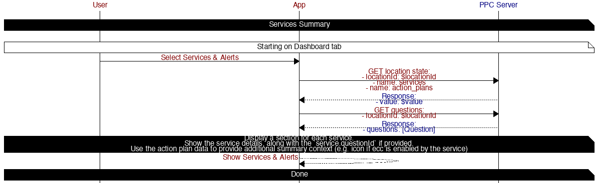

# Services and Alerts

## Table of contents

* [Services Summary](#services-summary)

## Diagrams

### Services Summary

#### APIS

##### [GET State](https://app.peoplepowerco.com/cloud/apidocs/cloud.html#tag/Synthetic-APIs/operation/Get%20Location%20State)

*Refresh services location state*

Params:
- locationId: $locationId
- name: services
- name: action_plans

##### [GET Questions](https://app.peoplepowerco.com/cloud/apidocs/cloud.html#tag/User-Communications/operation/Get%20Questions)

*Refresh questions*

Params:
- locationId: $locationId