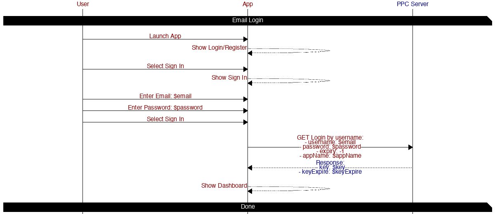
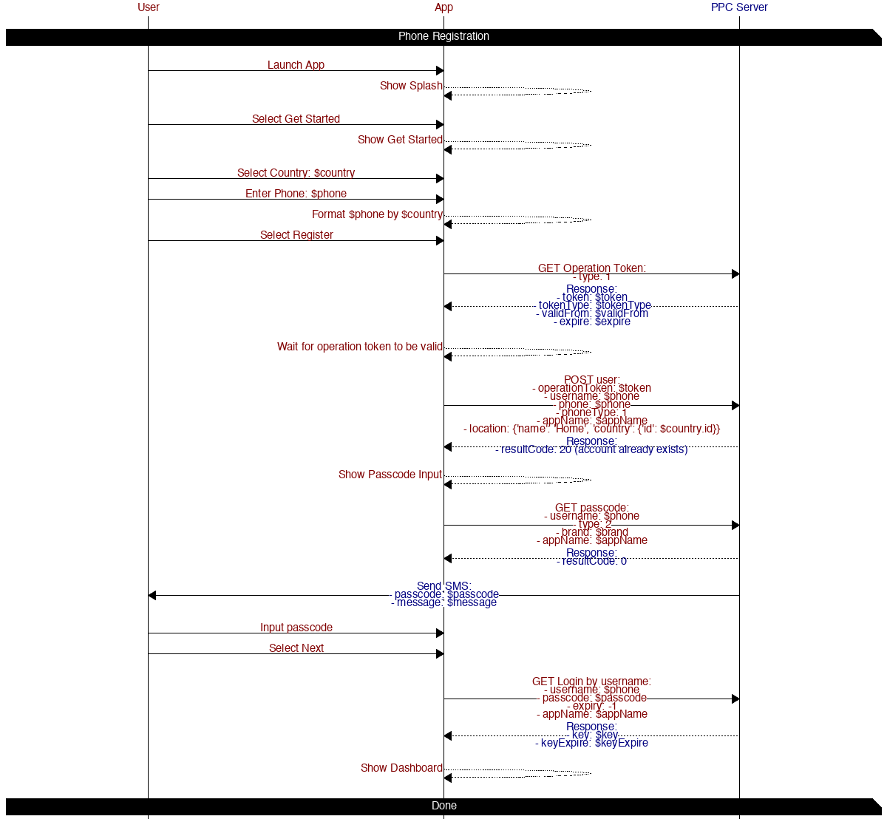
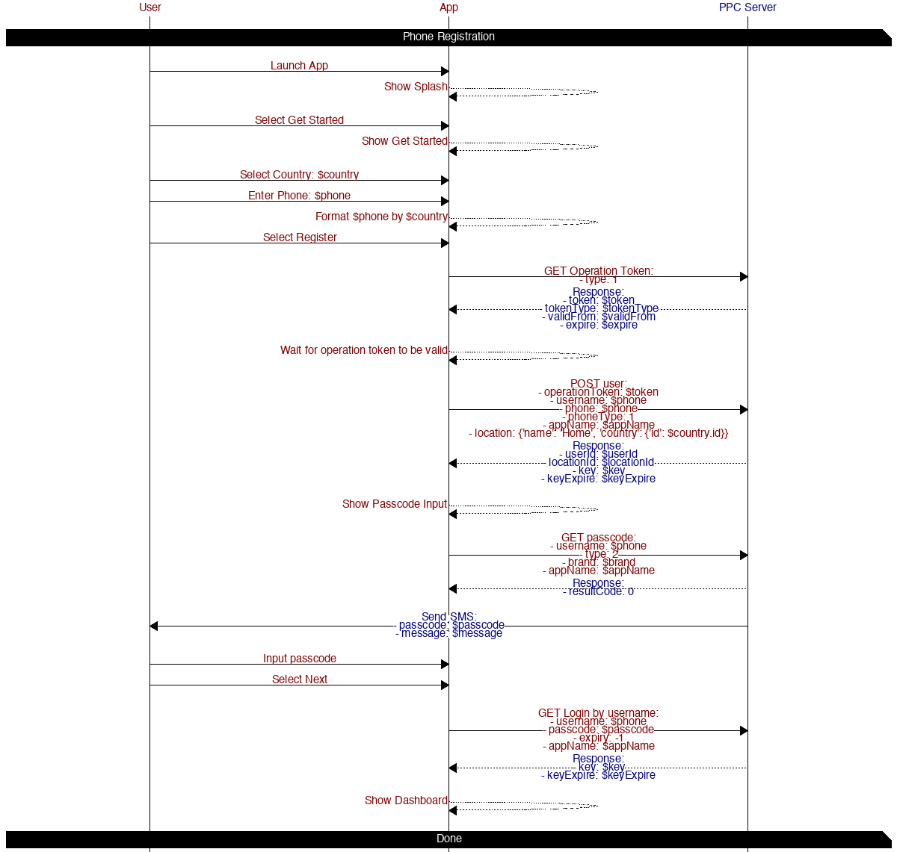
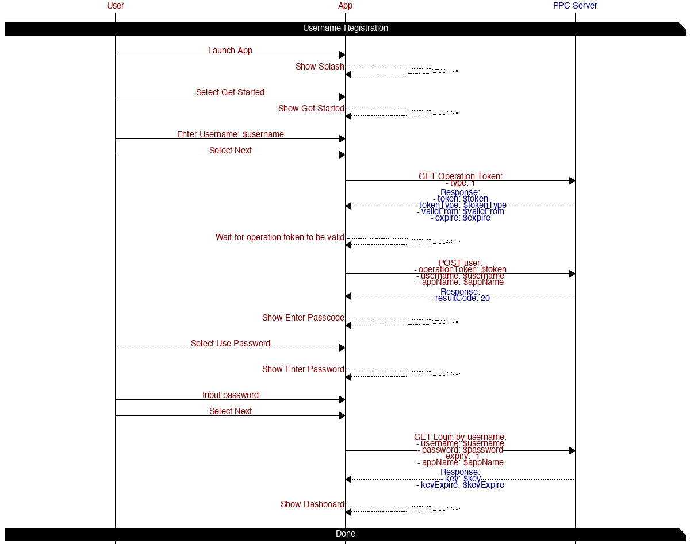
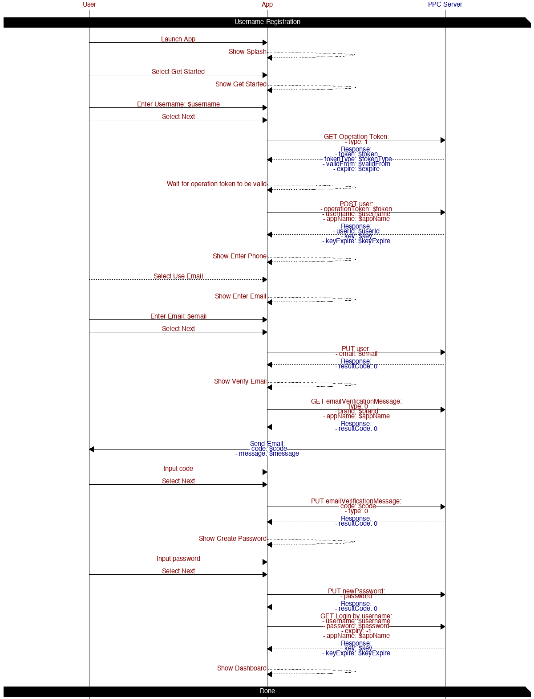
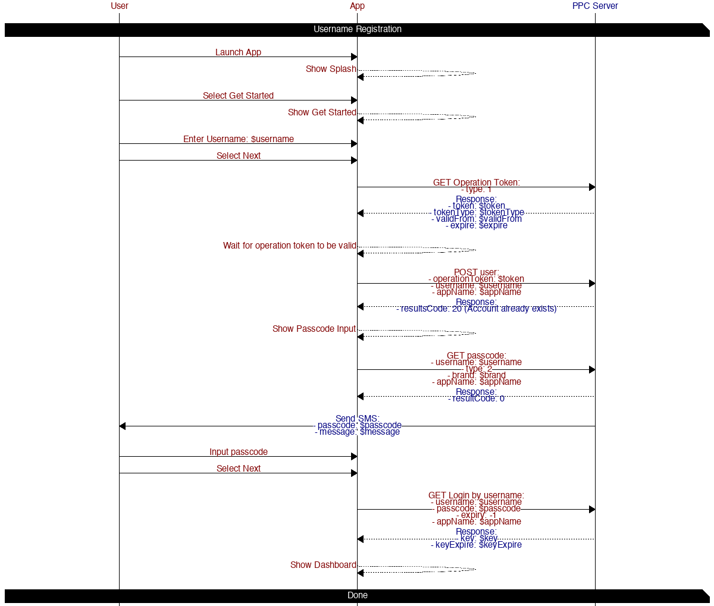
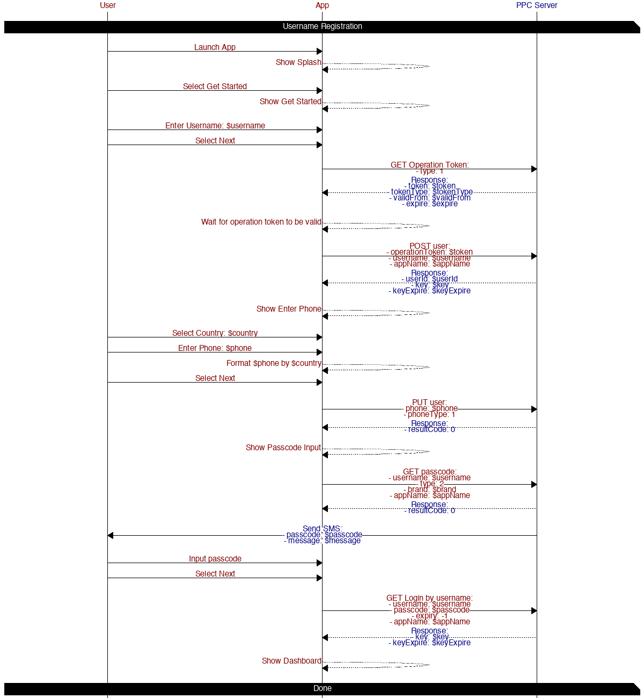

# User Login and Registration

## Table of contents

* [Email Login](#email-login)
* [Email Register](#email-register)
* [Phone login](#phone-login)
* [Phone Register](#phone-register)
* [Username Email Login](#username-email-login)
* [Username Email Register](#username-email-register)
* [Username Phone Login](#username-phone-login)
* [Username Phone Register](#username-phone-register)

## Diagrams

### Email Login

#### APIS

##### [GET Login by username](https://app.peoplepowerco.com/cloud/apidocs/cloud.html#tag/Authentication/operation/Login%20by%20Username)

*Login existing userLogin user*

Params:
- username: $email
- password: $password
- expiry: -1
- appName: $appName

### Email Register

#### APIS

##### [GET Operation Token](https://app.peoplepowerco.com/cloud/apidocs/cloud.html#tag/Authentication/operation/Get%20Operation%20Token)

*Retrieve an operation token*

Params:
- type: 1

##### [POST user](https://app.peoplepowerco.com/cloud/apidocs/cloud.html#tag/User-Accounts/operation/Create%20User%20and%20Location)

*Create a new user*

Params:
- operationToken: $token
- username: $email
- email: $email
- password: $password
- appName: $appName
- location: `{'name': 'Home'}`

### Phone login

#### APIS

##### [GET Operation Token](https://app.peoplepowerco.com/cloud/apidocs/cloud.html#tag/Authentication/operation/Get%20Operation%20Token)

*Retrieve an operation token*

Params:
- type: 1

##### [POST user](https://app.peoplepowerco.com/cloud/apidocs/cloud.html#tag/User-Accounts/operation/Create%20User%20and%20Location)

*Create a new user*

Params:
- operationToken: $token
- username: $phone
- phone: $phone
- phoneType: 1
- appName: $appName
- location: `{'name': 'Home', 'country': {'id': $country.id}}`

##### [GET passcode](https://app.peoplepowerco.com/cloud/apidocs/cloud.html#tag/Authentication/operation/Send%20Passcode)

*Trigger a new passcode to be sent over sms*

Params:
- username: $phone
- type: 2
- brand: $brand
- appName: $appName

##### [GET Login by username](https://app.peoplepowerco.com/cloud/apidocs/cloud.html#tag/Authentication/operation/Login%20by%20Username)

*Login existing user*

Params:
- username: $phone
- passcode: $passcode
- expiry: -1
- appName: $appName

### Phone Register

#### APIS

##### [GET Operation Token](https://app.peoplepowerco.com/cloud/apidocs/cloud.html#tag/Authentication/operation/Get%20Operation%20Token)

*Retrieve an operation token*

Params:
- type: 1

##### [POST user](https://app.peoplepowerco.com/cloud/apidocs/cloud.html#tag/User-Accounts/operation/Create%20User%20and%20Location)

*Create a new user*

Params:
- operationToken: $token
- username: $phone
- phone: $phone
- phoneType: 1
- appName: $appName
- location: `{'name': 'Home', 'country': {'id': $country.id}}`

##### [GET passcode](https://app.peoplepowerco.com/cloud/apidocs/cloud.html#tag/Authentication/operation/Send%20Passcode)

*Trigger a new passcode to be sent over sms*

Params:
- username: $phone
- type: 2
- brand: $brand
- appName: $appName

##### [GET Login by username](https://app.peoplepowerco.com/cloud/apidocs/cloud.html#tag/Authentication/operation/Login%20by%20Username)

*Login existing user*

Params:
- username: $phone
- passcode: $passcode
- expiry: -1
- appName: $appName

### Username Email Login

#### APIS

##### [GET Operation Token](https://app.peoplepowerco.com/cloud/apidocs/cloud.html#tag/Authentication/operation/Get%20Operation%20Token)

*Retrieve an operation token*

Params:
- type: 1

##### [POST user](https://app.peoplepowerco.com/cloud/apidocs/cloud.html#tag/User-Accounts/operation/Create%20User%20and%20Location)

*Create a new user*

Params:
- operationToken: $token
- username: $username
- appName: $appName

##### [GET Login by username](https://app.peoplepowerco.com/cloud/apidocs/cloud.html#tag/Authentication/operation/Login%20by%20Username)

*Login existing user*

Params:
- username: $username
- password: $password
- expiry: -1
- appName: $appName

### Username Email Register

#### APIS

##### [GET Operation Token](https://app.peoplepowerco.com/cloud/apidocs/cloud.html#tag/Authentication/operation/Get%20Operation%20Token)

*Retrieve an operation token*

Params:
- type: 1

##### [POST user](https://app.peoplepowerco.com/cloud/apidocs/cloud.html#tag/User-Accounts/operation/Create%20User%20and%20Location)

*Create a new user*

Params:
- operationToken: $token
- username: $username
- appName: $appName

##### [PUT user](https://app.peoplepowerco.com/cloud/apidocs/cloud.html#tag/User-Accounts/operation/Update%20User)

*Update users email*

Params:
- email: $email

##### [GET emailVerificationMessage](https://app.peoplepowerco.com/cloud/apidocs/cloud.html#tag/User-Accounts/operation/Send%20Verification%20Message)

*Trigger a verification message be sent*

Params:
- type: 0
- brand: $brand
- appName: $appName

##### [PUT emailVerificationMessage](https://app.peoplepowerco.com/cloud/apidocs/cloud.html#tag/User-Accounts/operation/Provide%20Verification%20Code)

*Apple email verification code*

Params:
- code: $code
- type: 0

##### [PUT newPassword](https://app.peoplepowerco.com/cloud/apidocs/cloud.html#tag/User-Accounts/operation/Update%20Password)

*Update new password*

Params:
- password

##### [GET Login by username](https://app.peoplepowerco.com/cloud/apidocs/cloud.html#tag/Authentication/operation/Login%20by%20Username)

*Login existing user*

Params:
- username: $username
- password: $password
- expiry: -1
- appName: $appName

### Username Phone Login

#### APIS

##### [GET Operation Token](https://app.peoplepowerco.com/cloud/apidocs/cloud.html#tag/Authentication/operation/Get%20Operation%20Token)

*Retrieve an operation token*

Params:
- type: 1

##### [POST user](https://app.peoplepowerco.com/cloud/apidocs/cloud.html#tag/User-Accounts/operation/Create%20User%20and%20Location)

*Create a new user*

Params:
- operationToken: $token
- username: $username
- appName: $appName

##### [GET passcode](https://app.peoplepowerco.com/cloud/apidocs/cloud.html#tag/Authentication/operation/Send%20Passcode)

*Trigger a new passcode to be sent over sms*

Params:
- username: $username
- type: 2
- brand: $brand
- appName: $appName

##### [GET Login by username](https://app.peoplepowerco.com/cloud/apidocs/cloud.html#tag/Authentication/operation/Login%20by%20Username)

*Login existing user*

Params:
- username: $username
- passcode: $passcode
- expiry: -1
- appName: $appName

### Username Phone Register

#### APIS

##### [GET Operation Token](https://app.peoplepowerco.com/cloud/apidocs/cloud.html#tag/Authentication/operation/Get%20Operation%20Token)

*Retrieve an operation token*

Params:
- type: 1

##### [POST user](https://app.peoplepowerco.com/cloud/apidocs/cloud.html#tag/User-Accounts/operation/Create%20User%20and%20Location)

*Create a new user*

Params:
- operationToken: $token
- username: $username
- appName: $appName

##### [PUT user](https://app.peoplepowerco.com/cloud/apidocs/cloud.html#tag/User-Accounts/operation/Update%20User)

*Update users phone and phone type*

Params:
- phone: $phone
- phoneType: 1

##### [GET passcode](https://app.peoplepowerco.com/cloud/apidocs/cloud.html#tag/Authentication/operation/Send%20Passcode)

*Trigger a new passcode to be sent over sms*

Params:
- username: $username
- type: 2
- brand: $brand
- appName: $appName

##### [GET Login by username](https://app.peoplepowerco.com/cloud/apidocs/cloud.html#tag/Authentication/operation/Login%20by%20Username)

*Login existing user*

Params:
- username: $username
- passcode: $passcode
- expiry: -1
- appName: $appName
