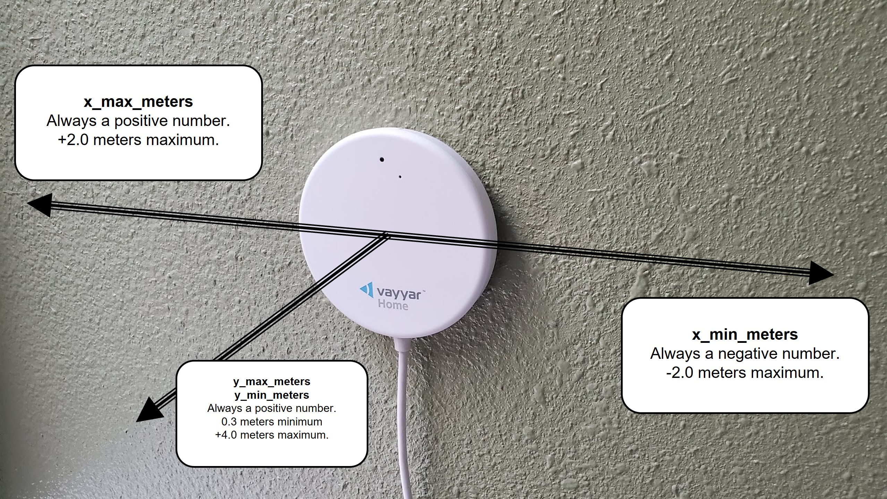
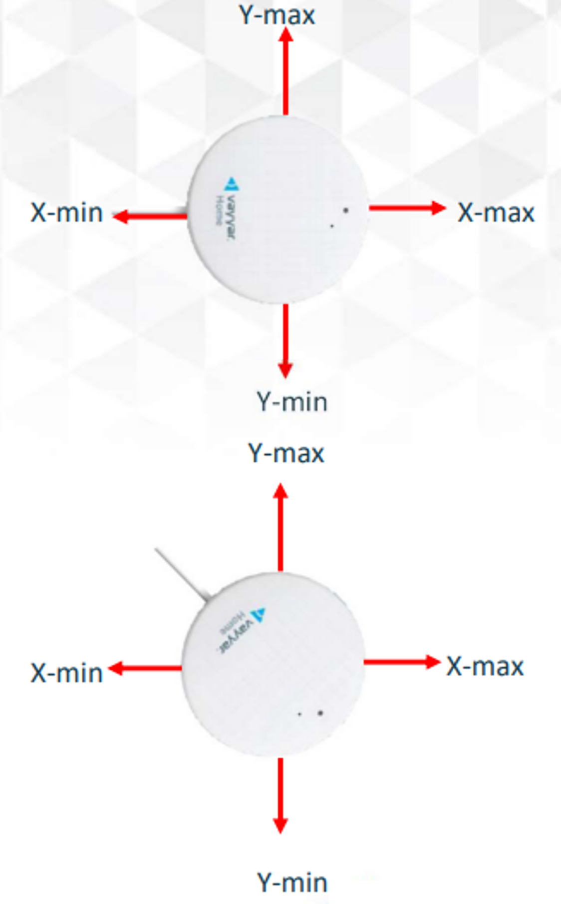

# Synthetic API: Radar

Radars can sense falls in real-time, and detect occupants in the room.

To use the device, we need to specify (a) the boundaries of the room, and (b) subregions within that room to ignore or detect special occupancy status (like a bed).

The device itself receives a behavior, using the standard `behaviors` state variable method. This gives context to the room the device is in.

Subregions require context, provided by the `radar_subregion_behaviors` state variable. Subregion descriptions will also describe what rooms they're compatible with (for example, you won't put a bed in the bathroom), the recommended size of that subregion (we know the size of a king size bed), and whether the subregion size is flexible. 

**Radar-generic addresses.** This Synthetic API is now implemented by the generic `radar` microservice package and applies to every supported radar device type: Vayyar Care (device type `2000`), AeroSense Assure (`2020`), Pontosense (`2007`) and Nobi (`2003`). The current data stream addresses are `set_radar_room`, `set_radar_subregion`, `delete_radar_subregion` and `set_radar_config`, and the current state variables are `radar_room`, `radar_subregions` and `radar_subregion_behaviors`.

**Inputs:**
* [Set the Room Boundaries](#set-the-room-boundaries)
* [Set a Subregion](#set-a-subregion)
* [Delete a Subregion](#delete-a-subregion)
* [Set Configuration](#set-configuration)
* [Submit Fall Feedback](#submit-fall-feedback)

**Outputs:**
* [Get the Room Boundaries](#get-the-room-boundaries)
* [Get the Defined Subregions](#get-the-defined-subregions)
* [Get the Available Subregion Behaviors](#get-the-available-subregion-behaviors)


## Inputs

### Set the Room Boundaries

Data Stream Address : `set_radar_room`

Out-of-range values are not rejected. They are clamped to the nearest limit the device supports, and all distances are rounded to 2 decimal places before being saved. The room must be at least 1.0 meter along each of the x and y axes; a smaller span is expanded to 1.0 meter.

#### Set Room Boundary Properties

| Property | Mounting Type | Value Type | Description |
| -------- | ------------- | ---------- | ----------- |
| device_id | | String | Required. Device ID to apply these room boundaries to. Must be a radar device at this location. |
| x_min_meters | Wall | Float | Required. Looking into the room from the device, this is the distance from the center of the device to the left wall of the room in meters. This is a negative number. Valid values range from `-3.0` to `0.0`; values below `-3.0` are clamped to `-3.0`. |
| x_max_meters | Wall | Float | Required. Looking into the room from the device, this is the distance from the center of the device to the right wall of the room in meters. This is a positive number. Valid values range from `0.0` to `2.0`; values above `2.0` are clamped to `2.0`. |
| y_max_meters | Wall | Float | Required. In a wall mount, this is the distance from the Vayyar Care to the opposite wall. Maximum is `4.0`; larger values are clamped. |
| y_min_meters | Wall | Float | Optional (0.3 default). In a wall mount, this is typically 0.3 meters which is just in front of the wall the Vayyar Care is mounted on. Values below `0.3` are clamped to `0.3`. |
| x_left_meters | Wall (deprecated) | Float | Deprecated but still functional. Migrate to `x_min_meters`. Same outcome as defining `x_min_meters`. |
| x_right_meters | Wall (deprecated) | Float | Deprecated but still functional. Migrate to `x_max_meters`. Same outcome as defining `x_max_meters`. |
| x_min_meters | Ceiling | Float | Required. In a ceiling mount, this is the distance from the Vayyar Care to the wall in the direction of the cable. Negative numbers only. -2.5 meters maximum. |
| x_max_meters | Ceiling | Float | Required. In a ceiling mount, this is the distance from the Vayyar Care to the wall in the opposite direction of the cable. Positive numbers only. +2.5 meters maximum. |
| y_min_meters | Ceiling | Float | Required. In a ceiling mount, this is the distance from the Vayyar Care to the wall toward the right of cable. Negative numbers only. -3.0 meters maximum. |
| y_max_meters | Ceiling | Float | Required. In a ceiling mount, this is the distance from the Vayyar Care to the wall toward the left of the cable. Positive numbers only. +3.0 meters maximum. |
| z_min_meters | | Float | Optional. The minimum height to detect, usually 0.0 (the ground). Default is 0.0. |
| z_max_meters | | Float | Optional. The maximum height to detect. Default is 2.0 meters for wall mounts (and clamped to 2.0 maximum), 3.0 meters for ceiling mounts. If set too high, objects (like vent fans) in the ceiling can cause false positive presence detects. |
| mounting_type | | int | 0 (default) = wall; 1 = ceiling; 2 = 45-degree ceiling; 3 = 45-degree wall; 4 = corner (Pontosense only) |
| sensor_height_m | | Float | Height of the sensor above the floor in meters. Optional for wall mounts and fixed at 1.5. Required for every other mounting type: ceiling and 45-degree ceiling mounts must be between 2.3 and 3.0 meters; 45-degree wall mounts between 2.1 and 2.4 meters; Pontosense corner mounts between 2.0 and 2.2 meters. |
| near_exit | | Boolean | Optional (default False). True if this radar device is located nearest to an exit door and can be used to determine occupancy of the living space. |


#### Set Room Boundary Example

**Wall Mount Example**
```
{
    "device_id": device_id,
    "x_min_meters": x_min_meters,
    "x_max_meters": x_max_meters,
    "y_max_meters": y_max_meters,
    "mounting_type": 0,
    "near_exit": False
}
```



**Ceiling Mount Example**
```
{
    "device_id": device_id,
    "x_min_meters": x_min_meters,
    "x_max_meters": x_max_meters,
    "y_min_meters": y_min_meters,
    "y_max_meters": y_max_meters,
    "sensor_height_m": 2.3,
    "mounting_type": 1,
    "near_exit": True
}
```




### Set a Subregion

Data Stream Address : `set_radar_subregion`

Applications should ensure subregion width and height are greater then or equal to 0.5 meters. All coordinates are rounded to 2 decimal places. On Pontosense devices the subregion width and length are additionally clamped to the minimum and maximum the device accepts for the given `context_id`.

If any of `x_min_meters`, `x_max_meters`, `y_min_meters` or `y_max_meters` is missing, the message is treated as a delete (see [Delete a Subregion](#delete-a-subregion)).

#### Set Subregion Properties

| Property | Type | Description |
| -------- | ---- | ----------- |
| device_id | String | Required. Device ID to apply this subregion to. Must be a radar device at this location. |
| unique_id | String | Some unique ID to add / edit / delete. If not defined, it will be assumed this is an add operation and will automatically generate a unique ID for this new subregion. |
| subregion_id | int | Optional - used primarily for modifying or deleting and for backwards compatibility. Subregion ID's are re-numbered 0..N-1 after every change. |
| context_id | int | Context / behavior of this subregion - see the [Subregion Behavior Properties](#subregion-behavior-properties). Also determines the defaults for `detect_falls`, `detect_presence`, `low_sensor_energy` and `is_door`. |
| name | String | Descriptive name of this subregion, default is the name of the subregion context that was selected (empty string if no `context_id`). |
| x_min_meters | Float | Required. For wall installs, looking into the room from the device, this is the left-most side of the sub-region. Remember to the left of Vayyar Care is negative numbers on the x-axis. For ceiling installs, standing at the cable side of the device and looking towards the device, this is the left-most side of the subregion. |
| x_max_meters | Float | Required. For wall installs, looking into the room from the device, this is the right-most side of the sub-region. For ceiling installs, standing at the cable side of the device and looking towards the device, this is the right-most side of the subregion. |
| y_min_meters | Float | Required. For wall installs, this is the distance from the Vayyar Care to the nearest side of the sub-region. Valid values are greater than or equal to `0.3`. For ceiling installs, standing at the cable side and looking towards the device, this is the rear side of the subregion. (e.g. distance from the device to your back) |
| y_max_meters | Float | Required. For wall installs, this is the distance from the Vayyar Care to the farthest side of the sub-region. For ceiling installs, standing at the cable side and looking towards the device, this is the front side of the subregion. (e.g. distance from the device to your front) |
| z_min_meters | Float | Optional. For 3D subregions, this is the minimum z-axis boundary. Default is 0.0. |
| z_max_meters | Float | Optional. For 3D subregions, this is the maximum z-axis boundary. Default is 2.0. |
| detect_falls | Boolean | Optional. True to detect falls in this subregion, False to avoid detecting falls. If omitted (or `null`), the recommendation for the given `context_id` is used (True when there is no context). |
| detect_presence | Boolean | Optional. True to detect people, False to not detect people. If omitted (or `null`), the recommendation for the given `context_id` is used (True when there is no context). |
| edit_falls | Boolean | Optional. If explicitly False, any `detect_falls` value in this message is discarded and the context recommendation is applied instead. |
| edit_presence | Boolean | Optional. If explicitly False, any `detect_presence` value in this message is discarded and the context recommendation is applied instead. |
| enter_duration_s | int | Optional. Number of seconds to wait until the radar declares someone entered this sub-region (default is 120 seconds). |
| exit_duration_s | int | Optional. Number of seconds to wait until the radar declares the sub-region is unoccupied (default is 120 seconds). |
| low_sensor_energy | Boolean | Optional. True allows better tracking of targets in a subregion with lower energy (low SNR). Default is the context recommendation: False for the door / exit context, otherwise True. |
| is_door | Boolean | Optional. True if this subregion is a door / entry way used for room entry and exit events. Default is the context recommendation: True for the door / exit context (`100`), otherwise False. |
| occupant_ids | List | Optional. List of location user ID's associated with this subregion (for example, who sleeps in this bed). If omitted, any previously stored `occupant_ids` for this subregion are preserved. |
| angle | int | Optional, Pontosense only. Orientation of the zone in degrees, clockwise from the top. Snapped to one of `0`, `90`, `180`, `270`. |
| hidden | Boolean | Optional. True if this subregion should be hidden from the end-user's view and only available for professional debugging. Note: synthetic (hidden) subregions are currently disabled in the bot, so a message with `hidden: true` is ignored and no subregion is created. |
| ai | Boolean | Optional. Set to True if this subregion was AI-generated. |

#### Set Subregion Example

```
{
    "device_id": device_id,
    "subregion_id": subregion_id,
    "name": descriptive_name,
    "x_min_meters": x_min_meters,
    "x_max_meters": x_max_meters,
    "y_min_meters": y_min_meters,
    "y_max_meters": y_max_meters,
    "z_min_meters": z_min_meters,
    "z_max_meters": z_max_meters,
    "detect_falls": detect_falls,
    "detect_presence": detect_presence,
    "enter_duration_s": enter_duration_s,
    "exit_duration_s": exit_duration_s,
    "context_id": context,
    "hidden": False
}
```

### Delete a Subregion

Data Stream Address : `delete_radar_subregion`

Passing in a `unique_id` is preferred, but this Synthetic API will also accept a `subregion_id` for backwards compatibility reasons.

**Warning:** if neither `unique_id` nor `subregion_id` is given, or the given ID does not exist, all subregions for the entire device are removed.

```
{
    "device_id": device_id,
    "unique_id": unique_id
}
```

```
{
    "device_id": device_id,
    "subregion_id": subregion_id
}
```

### Set Configuration

Data Stream Address : `set_radar_config`

This address only applies to Vayyar Care devices (device type `2000`). Messages for other radar device types are ignored.

```
# fall_sensitivity
FALL_SENSITIVITY_NO_FALLING = 0
FALL_SENSITIVITY_LOW = 1
FALL_SENSITIVITY_NORMAL = 2

# led_mode
LED_MODE_OFF = 0
LED_MODE_ON = 1

# volume
VOLUME_OFF = 0
VOLUME_ON = 100

# telemetry_policy
TELEMETRY_POLICY_OFF = 0
TELEMETRY_POLICY_ON = 1
TELEMETRY_POLICY_FALLS_ONLY = 2
TELEMETRY_POLICY_PRESENCE_ONLY = 3
```

#### `set_radar_config` Properties

All fields are optional except for `device_id`. Only the fields present in the message are applied.

| Property | Type | Description |
| -------- | ---- | ----------- |
| device_id | String | Required. Vayyar Care device ID. |
| fall_sensitivity | int | 0 = no fall detection; 1 = low; 2 = normal. |
| alert_delay_s | int | Delay in seconds from the 'confirmed' fall state to the 'calling' state. 15-30 is recommended. |
| led_mode | int | 0 = LEDs off; 1 = LEDs on. |
| volume | int | Buzzer volume from 0 (silent) to 100. |
| telemetry_policy | int | 0 = off; 1 = always on; 2 = on during fall events only (recommended default); 3 = on while presence is detected. |
| learning_mode | Boolean | True to start a 2-week learning period on the device; False to end it. |
| reporting_rate_ms | int | Minimum presence (occupancy target) reporting rate in milliseconds. Default is 5500. |
| reporting_enabled | int | 1 to enable periodic presence reporting; 0 to disable. |
| silent_mode | int | 1 to put the device in silent mode; 0 for normal operation. |
| target_change_threshold_m | Float | Deprecated. Accepted but no longer applied to the device. |
| falling_mitigator | int | 1 to enable the falling mitigator; 0 to disable. |

#### `set_radar_config` Example

```
{
    "device_id": "id_MzA6QUU6QTQ6TM6OEY6",
    "fall_sensitivity": FALL_SENSITIVITY_NORMAL,
    "alert_delay_s": 15,
    "led_mode": LED_MODE_ON,
    "volume": 100,
    "telemetry_policy": TELEMETRY_POLICY_FALLS_ONLY,
    "reporting_rate_ms": 5500,
    "silent_mode": False
}
```

### Submit Fall Feedback

Data Stream Address : `submit_radar_fall_feedback`

Record feedback about a radar fall event. All four fields are required; a message missing any of them is ignored. The bot currently records the feedback as a narrative on the location (event type `radar.fall_feedback_sent`); forwarding to the radar vendor's aggregation service is not enabled.

```
# classification
FEEDBACK_CLASSIFICATION_TRUE_POSITIVE = "TRUE_POSITIVE"
FEEDBACK_CLASSIFICATION_FALSE_POSITIVE = "FALSE_POSITIVE"
FEEDBACK_CLASSIFICATION_FALSE_NEGATIVE = "FALSE_NEGATIVE"
FEEDBACK_CLASSIFICATION_TEST_FALL = "TEST_FALL"
```

```
{
    "device_id": device_id,
    "classification": "FALSE_POSITIVE",
    "event_timestamp": event_timestamp_ms,
    "comment": "Resident was sitting on the floor playing with the dog."
}
```


## Outputs

### Get the room boundaries

State Variable : `radar_room`

One entry per radar device at the location, keyed by device ID. Values reflect the room boundaries saved for that device (or defaults for any field not yet set). `updated_ms` is the timestamp in milliseconds of the newest room boundary measurement reported by the device, or `0` if the device has not reported yet.

#### `radar_room` Example

```
{
    "device_id": {
        "mounting_type": 0,
        "sensor_height_m": 1.5,
        "x_min_meters": x_min_meters,
        "x_max_meters": x_max_meters,
        "y_min_meters": y_min_meters,
        "y_max_meters": y_max_meters,
        "z_min_meters": z_min_meters,
        "z_max_meters": z_max_meters,
        "near_exit": False,
        "updated_ms": updated_ms
    },
    ...
}
```

### Get the defined subregions

State Variable : `radar_subregions`

A dictionary keyed by device ID, each holding an ordered list of subregions. Each subregion contains the fields supplied to `set_radar_subregion` (with defaults filled in), minus `device_id`, plus:

| Property | Type | Description |
| -------- | ---- | ----------- |
| subregion_id | int | Index of this subregion in the device's list. Re-numbered 0..N-1 after every add or delete. |
| unique_id | String | Stable unique ID of this subregion. Use this to edit or delete it. |
| low_sensor_energy | Boolean | See [Set Subregion Properties](#set-subregion-properties). |
| is_door | Boolean | See [Set Subregion Properties](#set-subregion-properties). |
| parent_id | String | `null` for user-defined subregions. Set to the parent's `unique_id` for synthetic child subregions (currently disabled). |
| occupant_ids | List | Present only if occupants were ever assigned to this subregion. |
| ai | Boolean | Present only if this subregion was flagged as AI-generated. |

#### `radar_subregions` Example

```
{
  "value": {
    "id_MzA6QUU6QTQ6RTI": [
      {
        "context_id": 12,
        "unique_id": "d19978fe-606a-4ebf-8c51-b573b6ed0a23",
        "detect_falls": true,
        "detect_presence": true,
        "enter_duration_s": 120,
        "exit_duration_s": 120,
        "low_sensor_energy": true,
        "is_door": false,
        "parent_id": null,
        "name": "Bathtub / Shower",
        "hidden": False,
        "subregion_id": 0,
        "x_max_meters": -0.5,
        "x_min_meters": -1.29,
        "y_max_meters": 1.5,
        "y_min_meters": 0.3,
        "z_min_meters": 0,
        "z_max_meters": 2
      },
      {
        "context_id": 11,
        "unique_id": "2cc5d300-46df-4375-849b-1c4e32ceb466",
        "detect_falls": true,
        "detect_presence": true,
        "enter_duration_s": 120,
        "exit_duration_s": 120,
        "low_sensor_energy": true,
        "is_door": false,
        "parent_id": null,
        "name": "Toilet",
        "hidden": False,
        "subregion_id": 1,
        "x_max_meters": 0.25,
        "x_min_meters": -0.5,
        "y_max_meters": 1.3,
        "y_min_meters": 0.3,
        "z_min_meters": 0,
        "z_max_meters": 2
      },
      {
        "context_id": 14,
        "unique_id": "9c747dd7-1824-43d7-aeaa-2e4400928dfe",
        "detect_falls": true,
        "detect_presence": true,
        "enter_duration_s": 120,
        "exit_duration_s": 120,
        "low_sensor_energy": true,
        "is_door": false,
        "parent_id": null,
        "name": "Sink",
        "hidden": False,
        "subregion_id": 2,
        "x_max_meters": 1.25,
        "x_min_meters": 0.25,
        "y_max_meters": 1.3,
        "y_min_meters": 0.3,
        "z_min_meters": 0,
        "z_max_meters": 2
      }
    ],
    "id_MzA6QUU6QTQ6RTU": [
      {
        "context_id": 1,
        "unique_id": "49f9c146-8367-4d4d-ac06-172634473fe6",
        "detect_falls": false,
        "detect_presence": true,
        "enter_duration_s": 120,
        "exit_duration_s": 120,
        "low_sensor_energy": true,
        "is_door": false,
        "parent_id": null,
        "occupant_ids": [123456],
        "name": "King Bed",
        "hidden": False,
        "subregion_id": 0,
        "x_max_meters": 0.83,
        "x_min_meters": -1.1,
        "y_max_meters": 3.35,
        "y_min_meters": 1.25,
        "z_min_meters": 0,
        "z_max_meters": 2
      }
    ],
    "id_MzA6QUU6QTQ6RTM6": [
      {
        "context_id": 20,
        "unique_id": "3b7fd31c-5c59-462e-b97a-5d99127a94d4",
        "detect_falls": false,
        "detect_presence": true,
        "enter_duration_s": 120,
        "exit_duration_s": 120,
        "low_sensor_energy": true,
        "is_door": false,
        "parent_id": null,
        "name": "Office chair",
        "hidden": False,
        "subregion_id": 0,
        "x_max_meters": 0.0,
        "x_min_meters": -1.0,
        "y_max_meters": 1.52,
        "y_min_meters": 0.61,
        "z_min_meters": 0,
        "z_max_meters": 2
      }
    ]
  }
}
```

### Get the available Subregion Behaviors

State Variable : `radar_subregion_behaviors`

The device has to be associated with the correct location before you set the subregion, because the subregion requires context to be stored in non-volatile memory that is only associated with the location. If you move the device to a different location, you need to set the subregions again.

The list is regenerated (and its `title` / `description` strings re-localized) whenever the bot is upgraded, the location's language changes, or a radar device is added.

#### Subregion Context ID's

| context_id | Constant | Name | In behaviors list |
| ---------- | -------- | ---- | ----------------- |
| -1 | SUBREGION_CONTEXT_IGNORE | Ignore Region | Yes |
| 0 | SUBREGION_CONTEXT_BED | Bed (generic) | No |
| 1 | SUBREGION_CONTEXT_BED_KING | King Bed | Yes |
| 2 | SUBREGION_CONTEXT_BED_CALKING | California King Bed | Yes |
| 3 | SUBREGION_CONTEXT_BED_QUEEN | Queen Bed | Yes |
| 4 | SUBREGION_CONTEXT_BED_FULL | Full Bed | Yes |
| 5 | SUBREGION_CONTEXT_BED_TWINXL | Twin XL Bed | Yes |
| 6 | SUBREGION_CONTEXT_BED_TWIN | Twin Bed | Yes |
| 7 | SUBREGION_CONTEXT_BED_CRIB | Crib | Yes |
| 8 | SUBREGION_CONTEXT_END_TABLE | End Table | Yes |
| 9 | SUBREGION_CONTEXT_CPAP | CPAP Machine | Yes |
| 10 | SUBREGION_CONTEXT_BATHROOM | Bathroom | No |
| 11 | SUBREGION_CONTEXT_TOILET | Toilet (area where a person sits) | No |
| 12 | SUBREGION_CONTEXT_BATHTUB | Bathtub / Shower | Yes |
| 13 | SUBREGION_CONTEXT_WALK_IN_SHOWER | Shower | Yes |
| 14 | SUBREGION_CONTEXT_SINK | Sink | No |
| 15 | SUBREGION_CONTEXT_TOILET_TANK | Toilet (physical fixture) | Yes |
| 20 | SUBREGION_CONTEXT_CHAIR | Chair | Yes |
| 22 | SUBREGION_CONTEXT_COUCH | Couch | Yes |
| 23 | SUBREGION_CONTEXT_TABLE | Table / Desk | No |
| 99 | SUBREGION_CONTEXT_OTHER | Other | No |
| 100 | SUBREGION_CONTEXT_EXIT | Exit Door | Yes |

#### Subregion Behavior Properties

| Property | Type | Description |
| -------- | ---- | ----------- |
| context_id | int | Subregion Context ID to apply to this subregion. |
| title | String | Title of the subregion |
| description | String | Optional detail description if it helps - usually the title is enough, but there were a few that deserved a bit more explanation. |
| icon | String | Icon name |
| icon_font | String | Icon font to apply |
| width_cm | int | Recommended width of the subregion, in centimeters |
| length_cm | int | Recommended length of the subregion, in centimeters |
| flexible_cm | Boolean | True if the subregion size is flexible from our recommendations, False if this is a standard size |
| detect_falls | Boolean | True to recommend falls be detected for this subregion context. |
| edit_falls | Boolean | True to allow the user to see / edit whether fall detection can be turned on/off for this subregion context. False to prevent the user from seeing / editing whether fall detection can turn on or off for this subregion context. |
| detect_presence | Boolean | True to recommend detecting presence for this subregion context. |
| edit_presence | Boolean | True to allow the user to see / edit whether presence detection can be turned on/off for this subregion context. False to prevent the user from seeing / editing whether presence detection can turn on or off for this subregion context. |
| enter_duration_s | int | Recommended enter duration in seconds to set for this subregion context. Currently 120 for every context. |
| exit_duration_s | int | Recommended exit duration in seconds to set for this subregion context. Currently 120 for every context. |
| compatible_behaviors | List | List of compatible behavior ID's, as defined in the `behaviors` state: 0 = Bedroom, 1 = Bathroom, 2 = Living Room, 3 = Kitchen, 4 = Other, 5 = Office. |
| snap_to_wall | Boolean | True if this subregion must be snapped to at least one nearby wall, False if the subregion can be placed anywhere around the room. |
| required_mounting_types | List | Optional. If present, this subregion context is only offered for devices with one of these `mounting_type` values (see [Set Room Boundary Properties](#set-room-boundary-properties)). |
| supported_device_type_ids | List | Device types this subregion context can be used with (`2000` = Vayyar Care, `2007` = Pontosense). |
| synthetic_subregions | Dict | Optional, informational. Child subregions the bot could generate around this one (for example, end tables beside a bed), keyed by name, each with its own `context_id`, offsets in meters, size in centimeters and detect flags. Automatic generation is currently disabled. |

#### `radar_subregion_behaviors` Example

```
{
  "value": [
    {
      "compatible_behaviors": [
        0
      ],
      "context_id": 1,
      "detect_falls": false,
      "detect_presence": true,
      "edit_falls": false,
      "edit_presence": false,
      "enter_duration_s": 120,
      "exit_duration_s": 120,
      "flexible_cm": false,
      "icon": "bed-alt",
      "icon_font": "far",
      "length_cm": 204,
      "required_mounting_types": [
        1,
        2,
        4
      ],
      "snap_to_wall": true,
      "supported_device_type_ids": [
        2000,
        2007
      ],
      "synthetic_subregions": {
        "endtable_left": {
          "context_id": 8,
          "offset_x_meters": 0.97,
          "offset_y_meters": 0,
          "offset_z_meters": 0,
          "width_cm": 55,
          "length_cm": 55,
          "height_cm": 200,
          "detect_falls": false,
          "detect_presence": false
        },
        "endtable_right": {
          "context_id": 8,
          "offset_x_meters": -0.97,
          "offset_y_meters": 0,
          "offset_z_meters": 0,
          "width_cm": 55,
          "length_cm": 55,
          "height_cm": 200,
          "detect_falls": false,
          "detect_presence": false
        }
      },
      "title": "King Bed",
      "width_cm": 193
    },
    {
      "compatible_behaviors": [
        0
      ],
      "context_id": 2,
      "detect_falls": false,
      "detect_presence": true,
      "edit_falls": false,
      "edit_presence": false,
      "enter_duration_s": 120,
      "exit_duration_s": 120,
      "flexible_cm": false,
      "icon": "bed-alt",
      "icon_font": "far",
      "length_cm": 214,
      "required_mounting_types": [
        1,
        2,
        4
      ],
      "snap_to_wall": true,
      "supported_device_type_ids": [
        2000,
        2007
      ],
      "synthetic_subregions": { ... },
      "title": "California King Bed",
      "width_cm": 183
    },
    {
      "compatible_behaviors": [
        0
      ],
      "context_id": 3,
      "detect_falls": false,
      "detect_presence": true,
      "edit_falls": false,
      "edit_presence": false,
      "enter_duration_s": 120,
      "exit_duration_s": 120,
      "flexible_cm": false,
      "icon": "bed-alt",
      "icon_font": "far",
      "length_cm": 204,
      "required_mounting_types": [
        1,
        2,
        4
      ],
      "snap_to_wall": true,
      "supported_device_type_ids": [
        2000,
        2007
      ],
      "synthetic_subregions": { ... },
      "title": "Queen Bed",
      "width_cm": 153
    },
    {
      "compatible_behaviors": [
        0
      ],
      "context_id": 4,
      "detect_falls": false,
      "detect_presence": true,
      "edit_falls": false,
      "edit_presence": false,
      "enter_duration_s": 120,
      "exit_duration_s": 120,
      "flexible_cm": false,
      "icon": "bed-alt",
      "icon_font": "far",
      "length_cm": 191,
      "required_mounting_types": [
        1,
        2,
        4
      ],
      "snap_to_wall": true,
      "supported_device_type_ids": [
        2000,
        2007
      ],
      "synthetic_subregions": { ... },
      "title": "Full Bed",
      "width_cm": 135
    },
    {
      "compatible_behaviors": [
        0
      ],
      "context_id": 5,
      "detect_falls": false,
      "detect_presence": true,
      "edit_falls": false,
      "edit_presence": false,
      "enter_duration_s": 120,
      "exit_duration_s": 120,
      "flexible_cm": false,
      "icon": "bed-empty",
      "icon_font": "far",
      "length_cm": 204,
      "required_mounting_types": [
        1,
        2,
        4
      ],
      "snap_to_wall": true,
      "supported_device_type_ids": [
        2000,
        2007
      ],
      "synthetic_subregions": { ... },
      "title": "Twin XL Bed",
      "width_cm": 97
    },
    {
      "compatible_behaviors": [
        0
      ],
      "context_id": 6,
      "detect_falls": false,
      "detect_presence": true,
      "edit_falls": false,
      "edit_presence": false,
      "enter_duration_s": 120,
      "exit_duration_s": 120,
      "flexible_cm": false,
      "icon": "bed-empty",
      "icon_font": "far",
      "length_cm": 191,
      "required_mounting_types": [
        1,
        2,
        4
      ],
      "snap_to_wall": true,
      "supported_device_type_ids": [
        2000,
        2007
      ],
      "synthetic_subregions": { ... },
      "title": "Twin Bed",
      "width_cm": 97
    },
    {
      "compatible_behaviors": [
        0
      ],
      "context_id": 7,
      "detect_falls": false,
      "detect_presence": true,
      "edit_falls": false,
      "edit_presence": false,
      "enter_duration_s": 120,
      "exit_duration_s": 120,
      "flexible_cm": false,
      "icon": "baby",
      "icon_font": "far",
      "length_cm": 132,
      "required_mounting_types": [
        1,
        2,
        4
      ],
      "snap_to_wall": true,
      "supported_device_type_ids": [
        2000,
        2007
      ],
      "title": "Crib",
      "width_cm": 69
    },
    {
      "compatible_behaviors": [
        0,
        2,
        5
      ],
      "context_id": 8,
      "detect_falls": false,
      "detect_presence": false,
      "edit_falls": false,
      "edit_presence": false,
      "enter_duration_s": 120,
      "exit_duration_s": 120,
      "flexible_cm": true,
      "icon": "lamp-desk",
      "icon_font": "far",
      "length_cm": 55,
      "snap_to_wall": false,
      "supported_device_type_ids": [
        2000
      ],
      "title": "End Table",
      "width_cm": 55
    },
    {
      "compatible_behaviors": [
        0
      ],
      "context_id": 9,
      "detect_falls": false,
      "detect_presence": false,
      "edit_falls": false,
      "edit_presence": false,
      "enter_duration_s": 120,
      "exit_duration_s": 120,
      "flexible_cm": true,
      "icon": "air-conditioner",
      "icon_font": "far",
      "length_cm": 25,
      "snap_to_wall": false,
      "supported_device_type_ids": [
        2000
      ],
      "title": "CPAP Machine",
      "width_cm": 25
    },
    {
      "compatible_behaviors": [
        1
      ],
      "context_id": 15,
      "description": "Toilet.",
      "detect_falls": false,
      "detect_presence": true,
      "edit_falls": false,
      "edit_presence": false,
      "enter_duration_s": 120,
      "exit_duration_s": 120,
      "flexible_cm": false,
      "icon": "toilet",
      "icon_font": "far",
      "length_cm": 75,
      "snap_to_wall": true,
      "supported_device_type_ids": [
        2000,
        2007
      ],
      "synthetic_subregions": {
        "tank": {
          "context_id": -1,
          "offset_x_meters": 0,
          "offset_y_meters": 0,
          "offset_z_meters": 0,
          "width_cm": 55,
          "length_cm": 30,
          "height_cm": 200,
          "detect_falls": false,
          "detect_presence": false
        },
        "bowl": {
          "context_id": -1,
          "offset_x_meters": 0,
          "offset_y_meters": 0.3,
          "offset_z_meters": 0,
          "width_cm": 55,
          "length_cm": 45,
          "height_cm": 40,
          "detect_falls": false,
          "detect_presence": false
        },
        "person": {
          "context_id": 11,
          "offset_x_meters": 0,
          "offset_y_meters": 0,
          "offset_z_meters": 0,
          "width_cm": 76,
          "length_cm": 120,
          "height_cm": 200,
          "detect_falls": true,
          "detect_presence": true
        }
      },
      "title": "Toilet",
      "width_cm": 55
    },
    {
      "compatible_behaviors": [
        1
      ],
      "context_id": 12,
      "detect_falls": true,
      "detect_presence": true,
      "edit_falls": true,
      "edit_presence": false,
      "enter_duration_s": 120,
      "exit_duration_s": 120,
      "flexible_cm": false,
      "icon": "bath",
      "icon_font": "far",
      "length_cm": 82,
      "snap_to_wall": true,
      "supported_device_type_ids": [
        2000
      ],
      "title": "Bathtub / Shower",
      "width_cm": 152
    },
    {
      "compatible_behaviors": [
        1
      ],
      "context_id": 13,
      "detect_falls": true,
      "detect_presence": true,
      "edit_falls": false,
      "edit_presence": false,
      "enter_duration_s": 120,
      "exit_duration_s": 120,
      "flexible_cm": true,
      "icon": "shower",
      "icon_font": "far",
      "length_cm": 91,
      "snap_to_wall": true,
      "supported_device_type_ids": [
        2000
      ],
      "title": "Walk-in Shower",
      "width_cm": 152
    },
    {
      "compatible_behaviors": [
        2,
        4,
        0,
        3,
        5
      ],
      "context_id": 20,
      "detect_falls": false,
      "detect_presence": true,
      "edit_falls": false,
      "edit_presence": true,
      "enter_duration_s": 120,
      "exit_duration_s": 120,
      "flexible_cm": true,
      "icon": "loveseat",
      "icon_font": "far",
      "length_cm": 114,
      "snap_to_wall": false,
      "supported_device_type_ids": [
        2000,
        2007
      ],
      "title": "Chair",
      "width_cm": 135
    },
    {
      "compatible_behaviors": [
        2,
        4,
        0,
        5
      ],
      "context_id": 22,
      "detect_falls": false,
      "detect_presence": true,
      "edit_falls": false,
      "edit_presence": true,
      "enter_duration_s": 120,
      "exit_duration_s": 120,
      "flexible_cm": true,
      "icon": "couch",
      "icon_font": "far",
      "length_cm": 98,
      "snap_to_wall": false,
      "supported_device_type_ids": [
        2000,
        2007
      ],
      "title": "Sofa / Couch",
      "width_cm": 259
    },
    {
      "compatible_behaviors": [
        2,
        0,
        3,
        1,
        4,
        5
      ],
      "context_id": -1,
      "description": "Select this to prevent false alarms in this area of the room.",
      "detect_falls": false,
      "detect_presence": true,
      "edit_falls": false,
      "edit_presence": true,
      "enter_duration_s": 120,
      "exit_duration_s": 120,
      "flexible_cm": true,
      "icon": "eye-slash",
      "icon_font": "far",
      "length_cm": 50,
      "snap_to_wall": false,
      "supported_device_type_ids": [
        2000
      ],
      "title": "Ignore this area",
      "width_cm": 50
    },
    {
      "compatible_behaviors": [
        2,
        0,
        3,
        4,
        5,
        1
      ],
      "context_id": 100,
      "description": "This is used to define the area around a door or entry way.  When enabled, the Radar can alert you when someone enters or exits the room.",
      "detect_falls": false,
      "detect_presence": true,
      "edit_falls": false,
      "edit_presence": true,
      "enter_duration_s": 120,
      "exit_duration_s": 120,
      "flexible_cm": true,
      "icon": "door-open",
      "icon_font": "far",
      "length_cm": 50,
      "required_mounting_types": [
        1,
        2,
        4
      ],
      "snap_to_wall": false,
      "supported_device_type_ids": [
        2000,
        2007
      ],
      "title": "Door or entry way",
      "width_cm": 50
    }
  ]
}
```

## References
* `com.ppc.BotProprietary/signals/radar.py` (subregion context ID's, configuration constants and helper functions)
* `com.ppc.Microservices/intelligence/radar` (room, subregion and configuration data stream handlers)
* `com.ppc.Microservices/intelligence/radar_subregion_behaviors` (`radar_subregion_behaviors` state variable)
* `com.ppc.Bot/devices/radar/` (radar device classes: `vayyar`, `pontosense`, `nobi`, `axend`)
